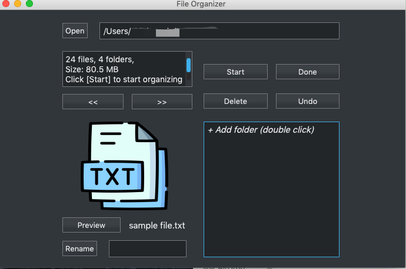
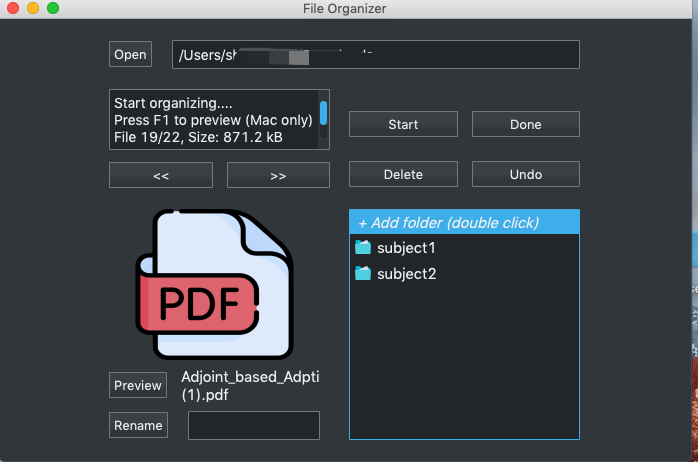

# File Organizer

A desktop application to help organizer files. This app is built with PyQT5. 

## Open a folder

## Start organizing files
- rename files
- move files to another folder
- delete files

